# Problem 10 — Style the website

**Goal:** the most inviting college-gear store a visitor has seen. It should show product within the first second, feel alive, and make buying effortless.

---

## 1. The foundation we already had

The site already covered every element in the brief. Problem 10 builds on these rather than replacing them.

| Element | What is in place |
|---|---|
| **Fonts** | *Cormorant Garamond* (a classic serif, echoing Yale's printed heritage) for headlines and prices; *Inter* for body text and buttons, so small text stays legible |
| **Color** | Yale Blue `#00356b` as the anchor, a lighter sky blue for accents, warm ivory and paper backgrounds instead of stark white, and green, amber, and red kept only for stock status |
| **Hierarchy** | One idea per section: small uppercase eyebrow → large serif headline → short lede → one primary button. Prices and stock sit next to every product |
| **Motion** | Headlines rise in, sections reveal on scroll, the marquee drifts, and cards lift on hover. All of it is disabled for visitors who set *reduce motion* |
| **Product presentation** | Uniform 4:5 cards on a soft ivory gradient, with the white photo backgrounds blended away (`mix-blend-mode: multiply`), color swatches, honest stock badges, hover zoom on the product page, and a live stock table |
| **Chat feel** | The concierge streams its answer word by word with a live status line ("Searching hoodies…"), docks beside results instead of covering them, and confirms actions with cards and toasts |

---

## 2. What we changed

### 2.1 The first screen now sells: a seasonal product spotlight

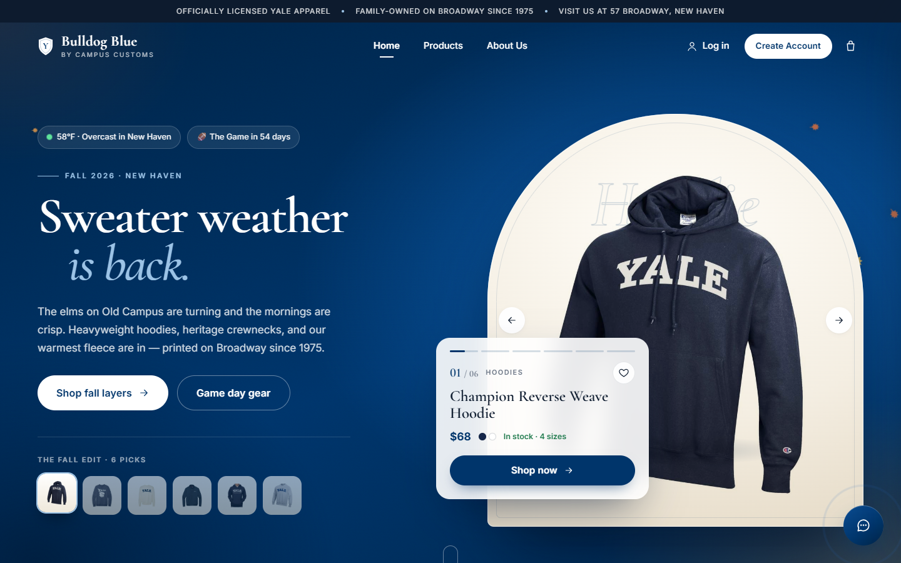

**Before:** a big slogan with three small static cards. On a phone, no product was visible until the visitor scrolled.
**Now:** the right half of the first screen is a **Yale-gothic arch** that shows one hero product at a time.
- The spotlight **changes every 5.6 seconds** with a cross-fade and a slow zoom.
- **Story-style progress bars** show what is coming next.
- Thumbnails, arrows, and swipe let the shopper take control; hovering pauses the rotation.
- The glass info card shows name, price, colors, **live stock** ("In stock · 4 sizes" or "Only 14 left"), a heart, and *Shop now*.

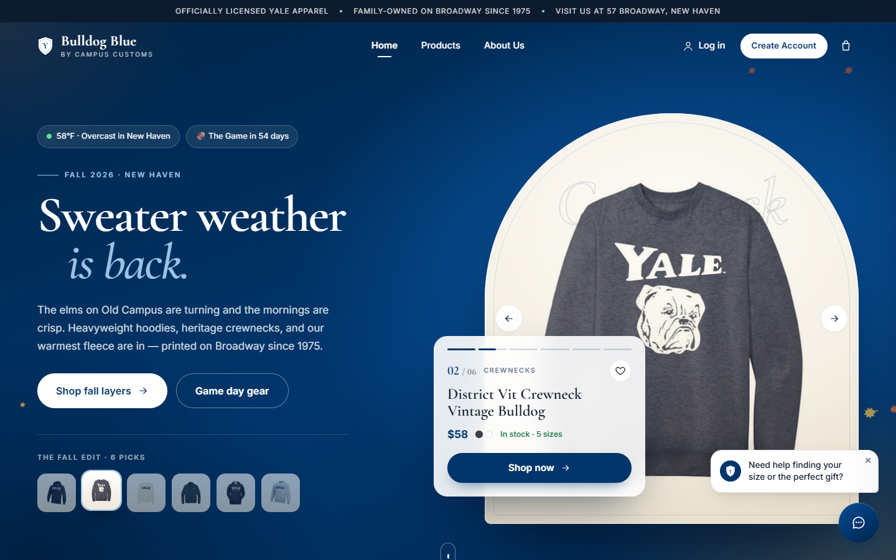

**Only the most impressive pieces appear.** We reviewed all 102 product photos and hand-picked the six strongest silhouettes for each season. For fall that is the navy Champion YALE hoodie, the vintage bulldog crewneck, the cream arched crewneck, the Brooks Brothers bomber, the black Forest School hoodie, and the Champion crewneck. Weaker photos (plain left-chest logos, very similar gray tees) never lead.

**On a phone, the product is above the fold.** The layout re-orders to headline → spotlight → buttons, so the first thing a thumb sees is a hoodie with a price, not a paragraph.

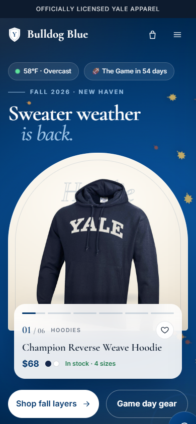

**Why it sells:** shoppers decide in seconds whether a store has something for them. A rotating, full-size product answers that before they scroll. Six hand-picked pieces set a premium first impression, and each is one tap from its product page.

### 2.2 The page follows the Yale calendar

The headline, copy, buttons, product lineup, and background glow change with the date (`frontend/src/lib/season.ts`):

| When | Campaign | Leads with |
|---|---|---|
| Sep – Nov | **"Sweater weather is back."** (it is getting colder) | Hoodies, heritage crewnecks, the bomber |
| The 7 days before The Game | **"Beat Harvard. Wear it loud."** | Game-day hood, football tees, warm layers |
| Dec 1 – 24 | **"Gift the Bulldog Blue."** | Premium labels, Mom and Dad pieces |
| Late Dec – Feb | **"Bundle up, Bulldogs."** | Fleece, full-zips, heavyweight crews |
| Mar – Apr / May / Jun – Jul / Aug | Spring · Commencement · Summer · Move-in | Quarter-zips · school crests and family pieces · tees · first-year essentials |

Two live chips sit above the headline:
- **today's New Haven temperature and sky**, from the free Open-Meteo forecast API
- **"The Game in 54 days"**, computed as the Saturday before Thanksgiving, which links to game-day gear

In fall, a few **autumn leaves drift** through the hero; in winter, light **snow** does. Both are behind the content and switched off for *reduce motion*.

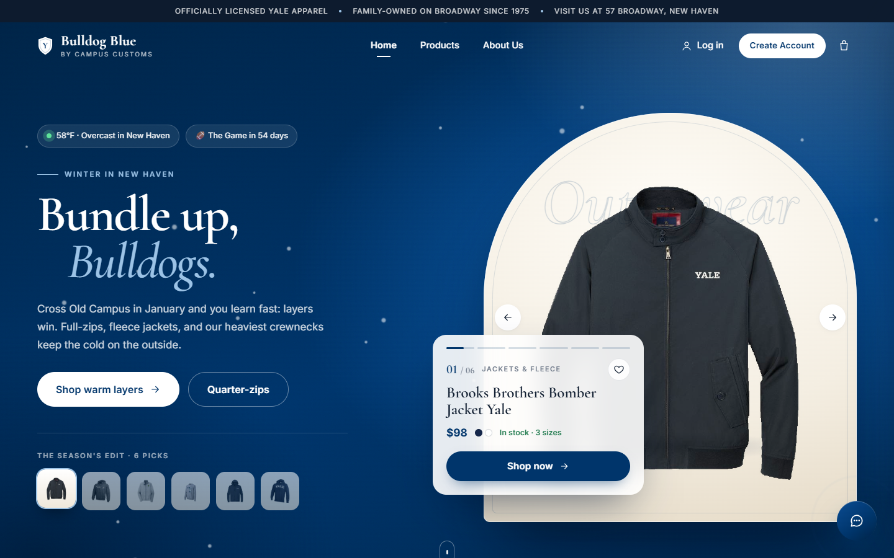
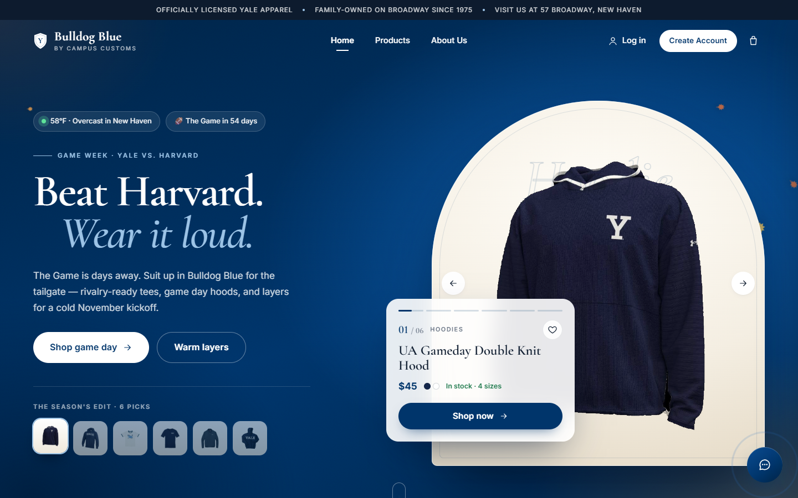

**Why it sells:** a store that says *"58°F · Overcast in New Haven"* and *"The Game in 54 days"* feels local, current, and staffed by people who know campus. It also lines up the merchandising with the moments Yale families actually buy: cold weather, rivalry week, gifts, graduation, and move-in.

*Preview any campaign with `/?season=winter`, `gameweek`, `holiday`, `spring`, `commencement`, `summer`, or `movein`.*

### 2.3 "Dressed for 58° today": a weather-aware edit

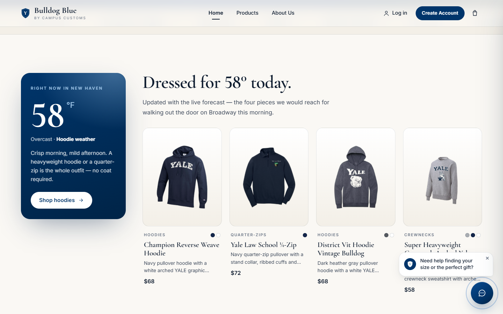

Right under the hero, a Yale Blue card shows the **live temperature** and a short styling tip. Next to it are **four products picked for that temperature band**:

| Band | Label | Picks |
|---|---|---|
| 45°F or below | Coat weather | Jackets and fleece |
| 46–60°F | Hoodie weather | Hoodies, a quarter-zip, heavyweight crews |
| 61–72°F | Crewneck weather | Crewnecks, a mockneck, a long-sleeve |
| Above 72°F | Tee weather | Tees |

If the forecast cannot be reached, the section uses New Haven's typical high for the month and says so.

**Why it sells:** it answers the question every shopper actually has, *"what do I wear this week?"*, and turns browsing into a ready-made outfit. It is the most direct way to act on "it is getting colder".

### 2.4 A live countdown to The Game

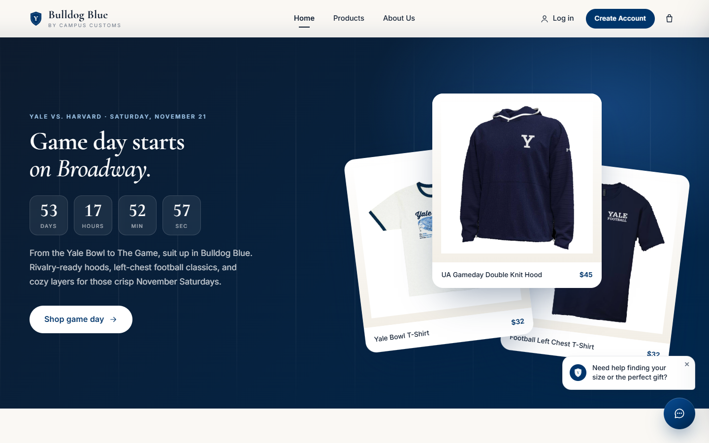

The tailgate section now opens with the date (*Yale vs. Harvard · Saturday, November 21*) and a ticking **days / hours / min / sec** countdown. The dated 2025 rivalry tee was swapped for the UA game-day hood.

**Why it sells:** a real deadline is honest urgency. Shoppers see they need to order soon for game day, and there is no invented "sale ends tonight".

### 2.5 Quick add on every product card

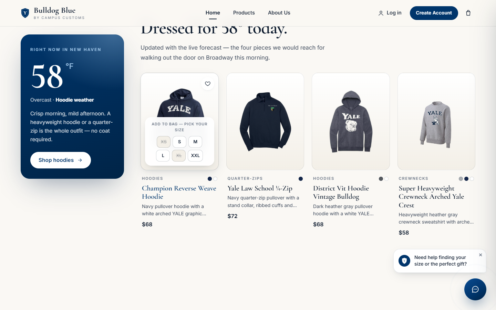

Hovering over any product card now shows **"+ Quick add"** where "View product" used to be. On a phone it is a small "+" button that is always visible.
- One tap opens the **live sizes**: sold-out sizes are struck through, low-stock sizes carry an amber dot, and the customer's **saved size** is outlined.
- A second tap puts the item in the bag and shows a toast with *View bag*.

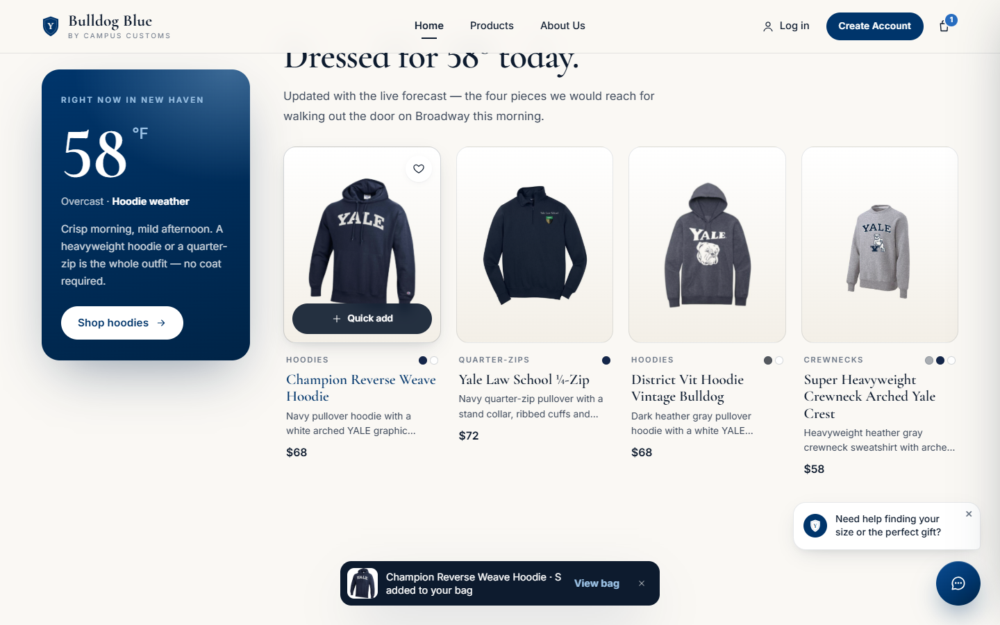

**Why it sells:** it goes from two page loads and four taps to **two taps without leaving the page**. That matters most on the home page and in grids, where shoppers compare many pieces.

### 2.6 A sticky add-to-bag bar on the product page

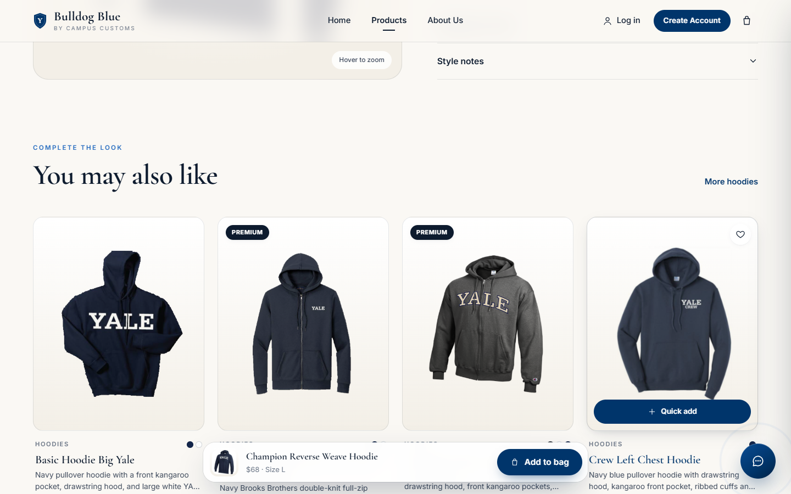

When the shopper scrolls past the *Add to bag* button (reading details, returns, or "You may also like"), a slim glass bar slides up with the product, price, chosen size, and **Add to bag**. With no size chosen, it scrolls back to the size picker. It hides whenever the concierge is open, so the two never overlap.

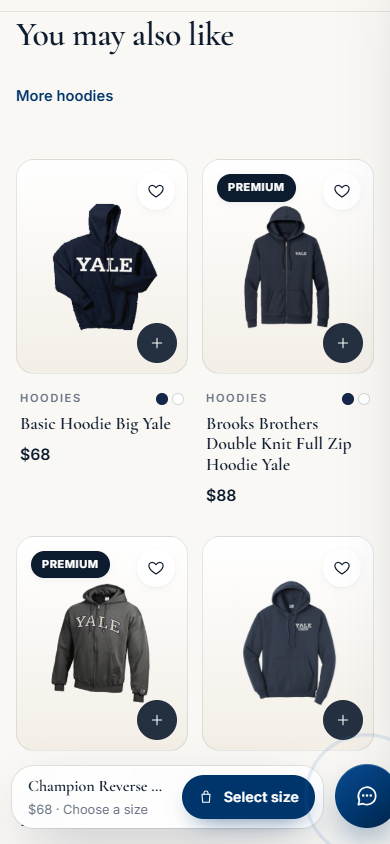

**Why it sells:** the buy button is always one tap away, at exactly the moment a shopper has finished convincing themselves.

### 2.7 Cleaner product names

Catalogue artefacts are tidied wherever customers see a name (`displayName()` in `api.ts`):
- "Champion Reverse Weave Hoodie **1**" → "Champion Reverse Weave Hoodie"
- "Yale Law School **1 4 Zip**" → "Yale Law School **¼-Zip**"
- "T Shirt" → "T-Shirt", "Ua" → "UA"

The database and the agent are unchanged. Small, but stray numbers read as unfinished, and polish is what makes a store feel premium.

---

## 3. Ideas borrowed from award-winning stores

| Idea | Where it comes from | How we used it |
|---|---|---|
| The online store as a **digital flagship** with boutique warmth | *Delvaux Digital Flagship Store* (Awwwards Honorable Mention, June 2026) | The Yale-gothic arch frames each piece like a shop window on Broadway |
| **Full-screen product gallery with motion** as the hero | *Mammut Digital Flagship Store* (Awwwards Site of the Day) | The rotating spotlight with cross-fade and slow zoom |
| **Intent-driven** shopping that adapts in real time | *Brunello Cucinelli – AI E-commerce* (Awwwards Site of the Day, July 2026) | Weather- and calendar-driven merchandising, plus the concierge from earlier problems |
| Story-style progress bars | The pattern social apps made universal | Visitors instantly understand "more is coming" and can jump ahead |
| Quick add and a sticky bag bar | Standard on leading fashion e-commerce sites | Fewer steps from interest to bag |

We only borrowed ideas that serve our goal, getting a shopper to a product and then to the bag. Pure spectacle (WebGL scenes, scroll-jacking) was left out because it slows the page and hides the product.

---

## 4. Guardrails

- **Honest data only:** stock lines, "Only N left", sizes, and prices are live from the database. The countdown is to a real date. There are no fake timers, discounts, or "12 people are viewing this".
- **Accessible:**
  - The carousel has labelled tabs, arrows, and keyboard focus, and it pauses on hover and focus.
  - With *reduce motion*, the spotlight stops rotating, and the leaves and snow are removed.
- **Fast:**
  - Weather is fetched once, cached for 30 minutes, and given a 4-second timeout.
  - Quick-add sizes are fetched only on tap and cached for 60 seconds.
  - No new libraries were added.
- **Verified:** the type-check is clean, and the screenshots above were taken in Microsoft Edge at 1440 × 900 and 390 × 844 with no console errors. Quick add was confirmed to add the right size to the bag without leaving the page.
